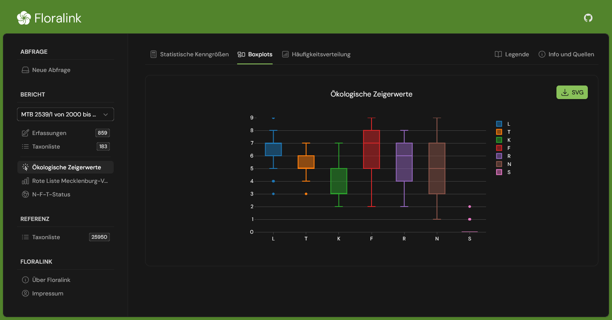

# Floralink

Floralink is a web client application for linking and analyzing data of plant occurrences with that of taxon specific traits like Ellenberg indicator values or Red List classifications. Built with Nuxt and some amazing modules for it, alongside Pinia and Tailwind.

> [!NOTE]  
> The user interface of Floralink is currently only available in German.
